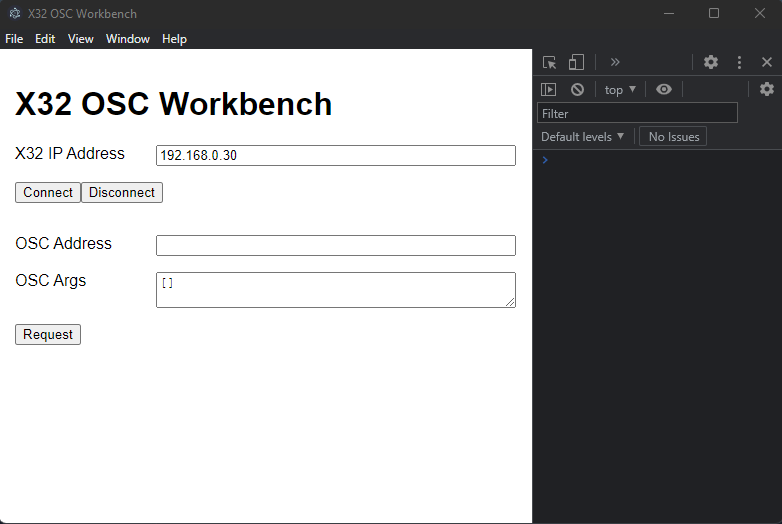

## X32 OSC Workbench
X32 OSC Workbench is a tool for testing OSC commands with either the X32/M32. It's primary focus is to provide a sandbox environment for sending and receiving OSC commands.

It's secondary focus is to provide code examples for building an OSC app with node that can connect to the X32.



## Further Reading 
I highly recommend reading through the following:
- The [unofficial x32 osc remote protocol](./x32%20osc%20guide/UNOFFICIAL_X32_OSC_REMOTE_PROTOCOL.pdf) guide by Patrick-Gilles Maillot
- the docs for the [node libary for OSC](https://github.com/colinbdclark/osc.js)
- The [X32 Emulator](https://sites.google.com/site/patrickmaillot/x32#h.p_rE4IH0Luimc0) also by Patrick-Gilles Maillot. A copy is included with in this project under the emulator folder.

## Installing
This project assumes you have node and node version manager installed. You can install a compatible version of node with
```
npm run installNode
npm run swapNode
```
Then install the dependencies with
```
npm install
```

## Starting the App
This project is a standard electron app with no other dependencies other than the node osc library. You can start the project by running. 
```
npm start 
```

## Tools Available in the Console
There are a few helper tools that are available in the console.

### `toFloat32`
Meeter values often comeback in a buffer of 32 bit floats. The OSC library will put them into a unit8Buffer which needs to be converted to get the 32 bit float values. The function also strips the padding at th beginning of the unit8Buffer.

### `argToFullScale`
Converts a linear value between 0 and 1 to a Full Scale (dbfs) value. The X32 talks in linear 0-1 numbers.

### `fullScaleToArg` 
Converts a linear Full Scale (dbfs) to an argument the X32 can understand - a value between 0 and 1.

### `castMeters6`
An example of how to read the metering values from a unit8Buffer.
